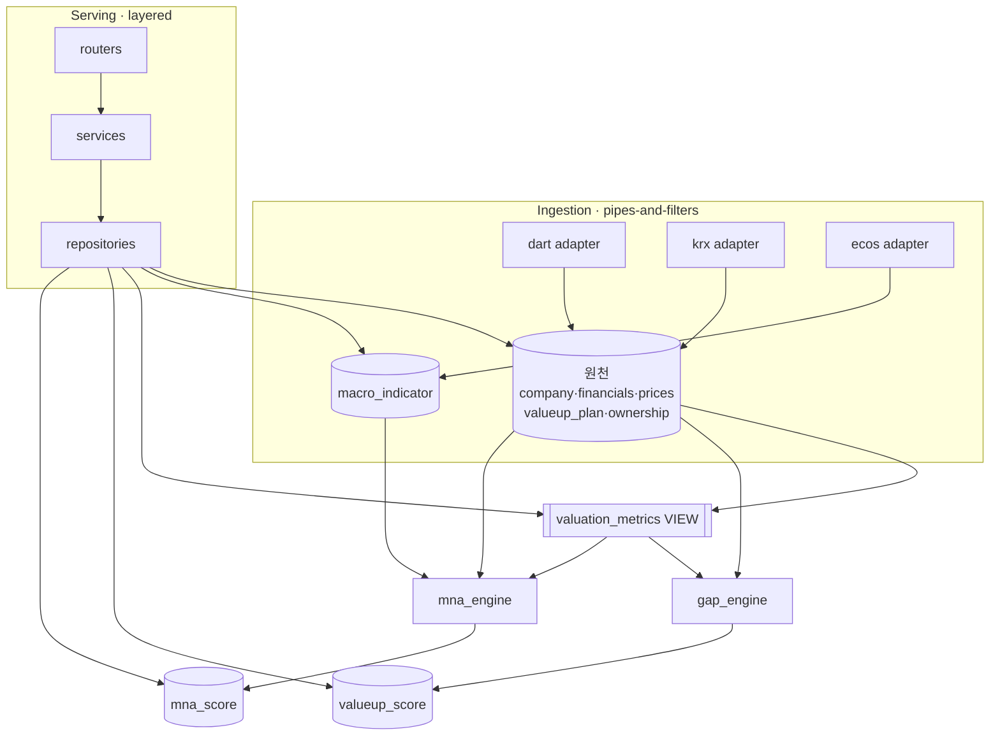

# Architecture Spine — valueup-washing

## Design Paradigm

**Layered 서빙 + Pipes-and-filters 수집.** 두 흐름이 DB를 경계로 분리된다.

- **수집(쓰기)**: `ingest/` — 소스 어댑터가 `fetch → normalize → upsert` 필터 체인으로 원천 테이블에 적재.
- **서빙(읽기)**: `routers/ → services/ → repositories/ → models/DB` 단방향 레이어.
- **파생/스코어**: 지표는 DB `VIEW`, 워싱 점수는 `analysis/` 엔진이 산출해 `valueup_score`에 적재.

```
app/
  routers/      # HTTP 경계 (FastAPI)
  services/     # 유스케이스 조합
  repositories/ # DB 접근 (유일한 SQL 실행 지점)
  models.py     # SQLAlchemy 모델 + valuation_metrics 뷰 매핑(읽기전용)
  analysis/     # gap_engine (Value-up), mna_engine (M&A)
  ingest/       # dart / krx / ecos 어댑터 + scheduler
  config.py     # 임계치·가중치·키
```

## Invariants & Rules

### AD-1 [ADOPTED] — 파생지표는 DB SQL VIEW로만
- **Binds:** CAP-3, `valuation_metrics`
- **Prevents:** ROE·PBR·PER 등을 여러 곳에서 다르게 계산해 값이 갈라지는 것
- **Rule:** 밸류에이션 지표는 파이썬에서 계산하지 않는다. 오직 `valuation_metrics` 뷰에서 조회한다. (DDL → `db-schema.md`)

### AD-2 — 레이어 의존은 단방향
- **Binds:** `all` 서빙 코드
- **Prevents:** 라우터가 DB를 직접 만지거나 하위→상위 역참조로 뒤엉키는 것
- **Rule:** `routers → services → repositories → models/DB` 방향으로만 의존. 라우터·서비스는 SQL을 실행하지 않고 repository를 통한다.

### AD-3 — 원천 테이블의 writer는 어댑터뿐
- **Binds:** CAP-1, CAP-2, CAP-8, CAP-9 / `company`·`financials`·`prices`·`valueup_plan`·`macro_indicator`·`ownership`
- **Prevents:** 원천 데이터가 두 곳에서 쓰여 소유권이 갈라지는 것
- **Rule:** 각 원천 테이블은 정확히 하나의 소스 어댑터(dart / krx / ecos)가 소유·기록한다. 어댑터는 공통 인터페이스 `fetch()→normalize()→upsert()`를 구현한다. 서빙 레이어는 원천 테이블에 쓰지 않는다. (dart: company·financials·valueup_plan·ownership / krx: prices / ecos: macro_indicator)

### AD-4 — valueup_score의 writer는 스코어링 엔진뿐
- **Binds:** CAP-4, CAP-5 / `valueup_score`
- **Prevents:** 워싱 판정·실행점수 로직이 여러 경로로 분기하는 것
- **Rule:** `analysis/gap_engine`만 `valueup_score`에 쓴다. 입력은 `valuation_metrics` 뷰 + `valueup_plan`. 임계치·가중치는 `config`에서 주입하며 하드코딩 금지. (산식 → `scoring.md`)

### AD-5 — corp_code가 정식 엔티티 키
- **Binds:** `all` 테이블·조인
- **Prevents:** 6자리 종목코드/8자리 corp_code 혼용으로 조인이 어긋나는 것
- **Rule:** 모든 테이블의 엔티티 키·FK는 `corp_code`(8자리). `stock_code`(6자리)는 `company`의 속성이며 조인 키로 쓰지 않는다.

### AD-6 — API 응답 형태 고정
- **Binds:** CAP-6, CAP-7 / 모든 라우터
- **Prevents:** 라우터마다 목록·에러 응답 모양이 달라지는 것
- **Rule:** 목록 응답은 `{items, total, page, size}` 봉투. 에러는 `{detail, code}`. 정렬은 `field`/`-field` 규약.

### AD-7 — 수집 적재는 멱등 upsert
- **Binds:** CAP-1, CAP-2 / 수집 파이프라인
- **Prevents:** 배치 재실행 시 같은 행이 중복 적재되는 것
- **Rule:** 자연키 기준 upsert. `financials`=(corp_code, year, quarter), `prices`=(corp_code, date), `valueup_plan`=(corp_code, disclosure_date).

### AD-8 — as_of 신선도 스탬프
- **Binds:** CAP-4 / `valueup_score`
- **Prevents:** 분기 실적 발표 시차가 진척률 계산에 암묵적으로 섞이는 것
- **Rule:** `valueup_score`는 `as_of` 컬럼을 갖고, `progress_rate` 계산의 `today`로 `as_of`를 쓴다.

### AD-9 — company 소유권 & 시가총액 단일 원천
- **Binds:** CAP-2 / `company`, `prices`
- **Prevents:** company를 두 어댑터가 쓰거나, `company.market_cap`과 `prices.market_cap`이 갈라지는 것
- **Rule:** `company`의 writer는 `dart_adapter`(정체성: corp_code·stock_code·corp_name·sector·market). 시가총액의 단일 진실원천은 `prices`(KRX). `company.market_cap`은 두지 않고, 시총이 필요하면 최신 `prices` 행을 조인/뷰로 노출한다.

### AD-10 — mna_score의 writer는 M&A 엔진뿐
- **Binds:** CAP-10 / `mna_score`
- **Prevents:** M&A 타겟 점수 로직이 여러 경로로 분기하는 것 (AD-4와 대칭)
- **Rule:** `analysis/mna_engine`만 `mna_score`에 쓴다. 입력은 `valuation_metrics` 뷰 + `ownership` + `macro_indicator`. 4요소 가중치(0.35/0.25/0.25/0.15)는 `config`에서 주입하며 하드코딩 금지. (산식 → `scoring.md`)

### AD-11 — 프론트엔드는 REST API로만 데이터 접근
- **Binds:** CAP-6, CAP-7 / 프론트엔드(React SPA)
- **Prevents:** 프론트가 DB/스키마에 직접 결합되거나, 서버상태·UI상태가 뒤섞여 상태관리가 제각각이 되는 것
- **Rule:** 프론트는 오직 REST API(AD-6 응답 봉투)로만 데이터를 읽는다(DB·SQL 직접 접근 없음). 서버상태는 TanStack Query, UI상태(필터·모드)는 로컬로 분리한다. API 필드명이 계약이며 프론트는 내부 테이블 구조를 알지 않는다.

### 의존 방향



## Consistency Conventions

| Concern | Convention |
| --- | --- |
| Naming | 테이블·컬럼 `snake_case`, 엔티티 키 `corp_code`, 어댑터 `{source}_adapter`, 라우터 `/{resource}` |
| Data & formats | 금액 KRW 정수(won), 비율 `numeric` %(소수 2자리), 날짜 ISO `YYYY-MM-DD`(KST), 지표 `null` 허용(`NULLIF`) |
| Envelopes | 목록 `{items,total,page,size}`, 에러 `{detail,code}` |
| State & config | 원천=어댑터만 쓰기, score=엔진만 쓰기, 지표=뷰 읽기전용. 임계치·가중치·API키는 `config`(pydantic-settings/`.env`) |

## Stack

| Name | Version |
| --- | --- |
| Python | 3.12 `[ASSUMPTION]` |
| FastAPI | 0.139.0 |
| SQLAlchemy | 2.0.51 |
| PostgreSQL | 17 `[ASSUMPTION]` |
| alembic | 최신 (테이블 마이그레이션; 뷰는 raw SQL) |
| dart-fss / pykrx / requests(ECOS) | `[ASSUMPTION]` 설치 시 최신 핀 확인 |
| pandas / numpy | 스코어링 |
| APScheduler | 일배치 + 수동 트리거 |
| React | 19.2.7 |
| Vite | 8.1.3 |
| TypeScript / TanStack Query·Table / Recharts / shadcn-ui / Tailwind | `[ASSUMPTION]` 설치 시 핀 확인 |

## Capability → Architecture Map

| Capability | Lives in | Governed by |
| --- | --- | --- |
| CAP-1 공시수집 | `ingest/dart_adapter` → `valueup_plan` | AD-3, AD-7 |
| CAP-2 원천데이터 | `ingest/{dart,krx}` → `company·financials·prices` | AD-3, AD-5, AD-7, AD-9 |
| CAP-3 지표계산 | `valuation_metrics` VIEW (EV/EBITDA 포함) | **AD-1** |
| CAP-4 Value-up 스코어링 | `analysis/gap_engine` → `valueup_score` | AD-4, AD-8 |
| CAP-5 워싱판정 | `analysis/gap_engine` | AD-4 (scoring.md) |
| CAP-6 스크리닝/랭킹 API | `routers/valueup·mna·metrics` | AD-2, AD-6 |
| CAP-7 통계 API | `routers/stats` | AD-2, AD-6 |
| CAP-8 매크로수집 | `ingest/ecos` → `macro_indicator` | AD-3, AD-7 |
| CAP-9 지분구조 | `ingest/dart` → `ownership` | AD-3, AD-7 |
| CAP-10 M&A 스코어 | `analysis/mna_engine` → `mna_score` | **AD-10**, AD-8 |

## Deferred

- **인증/인가** — v1 비목표(내부 도구). 외부 노출 시 재검토.
- **배포·운영 envelope**(호스팅, CI, 시크릿 관리) — 로컬 개발 우선. 배포 결정 시 별도.
- ~~프론트엔드~~ → **정식 편입됨**(AD-11, React SPA). 더 이상 Deferred 아님.
- **밸류업 목표치 정규화 규칙**(open Q1) — 범위/서술형 목표의 수치화 방식 미확정. 아키텍처는 `valueup_plan.raw_text` 원문 보존으로 대응, CAP-1 스토리에서 파서 규칙 확정.
- **캐싱/성능** — 뷰가 느려지면 `MATERIALIZED VIEW` 승격(db-schema.md에 명시). 데모 규모에선 불필요.
